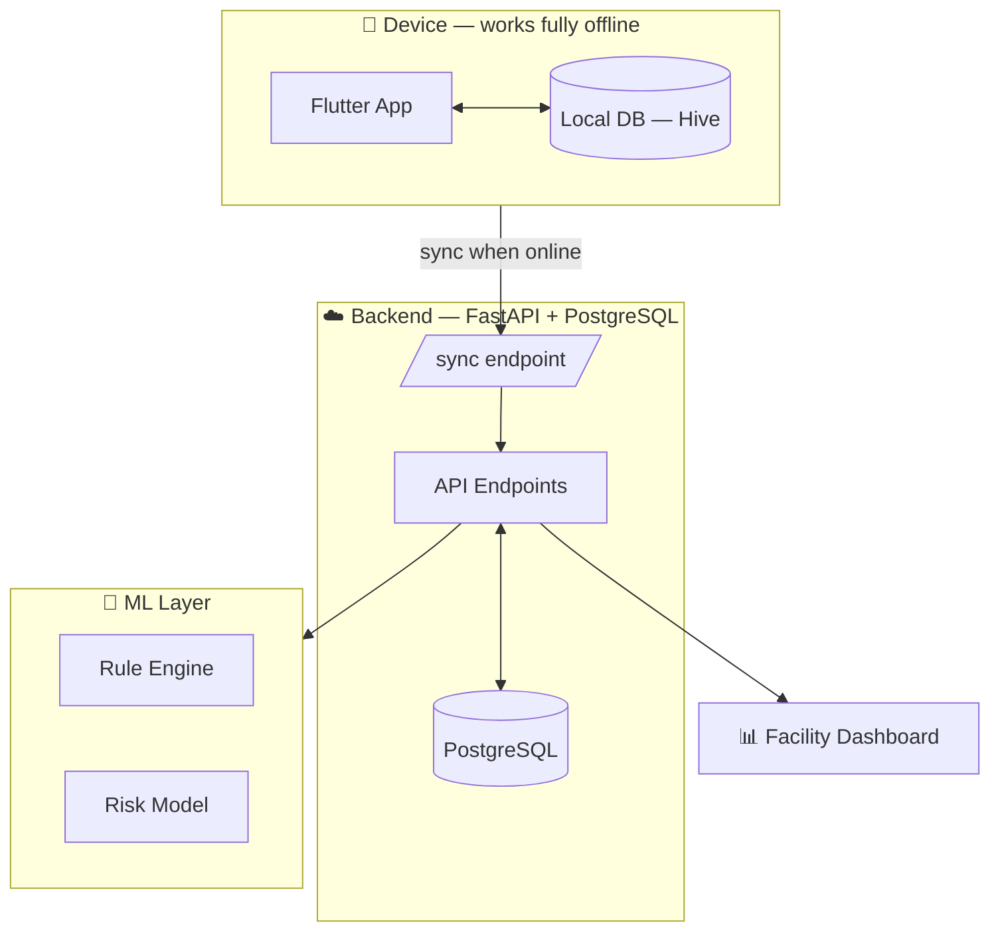
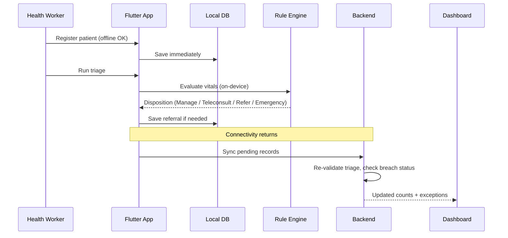

<div align="center">

# 🌉 SETU-Swasthya

### The bridge between a rural patient and the care they can't reach.

A hybrid offline-and-online mobile platform that gives frontline health workers a
shared patient record, offline triage with automatic red-flag detection, assisted
teleconsultation, and referrals that can never silently disappear.

[]()
[]()
[]()
[]()
[]()
[]()
[]()

</div>

<br>

## Why this exists

> In a typical rural district, a patient's care is scattered across four or five
> disconnected facility tiers, with no shared record, no tracked referrals, and
> specialists concentrated far from where most patients live.

- 🩺 **A pregnant woman flagged high-risk** at a sub-centre can reach a district
  hospital months later with none of her history available.
- 📋 **A referral written on a paper slip** is never tracked — nobody knows if the
  patient ever arrived.
- 📡 **A specialist opinion costs a full day's wage** because it means physically
  travelling to district headquarters.

SETU-Swasthya closes these gaps with software that works **completely offline**,
**syncs automatically** when a signal is found, and turns every clinical commitment
into something with a status, an owner, and a due date.

<br>

## ✨ Core capabilities

| | |
|---|---|
| 🚦 **Rule-based triage** | Deterministic, auditable, explainable red-flag detection — not a black box. Runs fully on-device. |
| 📞 **Assisted teleconsultation** | A health worker sits with the patient; a distant specialist weighs in — video → audio → store-and-forward, degrading gracefully with connectivity. |
| 🔁 **Closed-loop referrals** | Every referral is a stateful object (`Initiated → Booked → Consulted → Closed`) with automatic breach detection and escalation. |
| 🗂️ **Longitudinal patient record** | One record per patient, written locally first, synced the moment connectivity returns. |
| 📊 **Exception-first dashboards** | Managers see what's broken and who owns it — not a raw data dump. |

<br>

## 🚀 MVP status

A working, installable app demonstrating the full offline-and-online loop:

- [x] Offline-first patient registration
- [x] Rule-based triage with red-flag detection
- [x] Referral creation and breach tracking
- [x] Basic facility dashboard (counts + exceptions)

<details>
<summary><strong>MVP success criteria</strong></summary>
<br>

1. The app works fully with the device offline (airplane mode) for registration and triage.
2. Triage correctly flags at least one emergency case using the red-flag logic.
3. A referral can be created, its status is visible, and a breach is correctly shown
   after the relevant time threshold.
4. Data created offline syncs correctly to the backend once connectivity returns.
5. The dashboard reflects live counts pulled from the backend.

</details>

<details>
<summary><strong>Deferred to later phases</strong></summary>
<br>

Appointment/queue management, diagnostic coordination, medicine availability,
high-risk registries, dedicated emergency escalation, full teleconsultation
(video/media server), interoperability (FHIR/ABDM), and all security/consent/
compliance work required before real patient data is used.

</details>

<br>

## 🏗️ Architecture



<br>

## 🔄 How a single patient record moves through the system



<br>

## 🧰 Tech stack

<table>
<tr>
<td valign="top" width="50%">

**Mobile**
- Flutter (Dart) — offline-first, Android first
- Hive → Isar/SQLite (later phases)
- Riverpod (state management)
- go_router (navigation)
- dio + Sync Service (networking/sync)
- workmanager (background sync)

</td>
<td valign="top" width="50%">

**Backend & ML**
- FastAPI (Python 3.11+)
- PostgreSQL via SQLModel + Alembic
- JWT → OIDC (auth)
- Deterministic Python rule engine (triage)
- scikit-learn on synthetic data (risk modeling)
- Docker + docker-compose

</td>
</tr>
</table>

> No proprietary or vendor-locked components. All patient/village/facility data in the
> MVP is **synthetic** — never real patient information.

<br>

## ⚡ Getting started

<details open>
<summary><strong>Prerequisites</strong></summary>
<br>

- Docker + docker-compose
- Python 3.11+
- Flutter SDK (`flutter doctor` passes with no errors)

</details>

<details>
<summary><strong>Backend setup</strong></summary>

```bash
# Start the API + database
docker-compose up

# Run migrations after changing a model
alembic revision --autogenerate -m "describe the change"
alembic upgrade head

# Run tests
pytest

# Interactive API docs → http://localhost:8000/docs
```

</details>

<details>
<summary><strong>Frontend setup</strong></summary>

```bash
# Install dependencies
flutter pub get

# Run on a connected device or emulator
flutter run

# Regenerate Hive type adapters after changing a local model
dart run build_runner build --delete-conflicting-outputs

# Build a release APK
flutter build apk --release
```

> **Testing offline behavior:** enable airplane mode, use the app normally
> (registration + triage), then reconnect and confirm sync completes. This is the
> single most important manual test in the whole build.

</details>

<details>
<summary><strong>Machine learning setup</strong></summary>

```bash
# Run rule engine unit tests
pytest ml/tests/

# Regenerate the synthetic dataset
python ml/generate_synthetic_data.py

# Retrain the risk-scoring model
python ml/train_risk_model.py
```

</details>

<br>

## 👥 Team

| | Member | Focus |
|---|---|---|
| 🔧 | **Aditya** | Backend lead — FastAPI, database, API contract |
| 🔧 | **Iqra** | Backend — endpoints, integration, deployment |
| 🎨 | **Faeza** | Frontend — Flutter UI, offline data layer |
| 🎨 | **Prateek** | Frontend — state management, sync, connectivity |
| 🧠 | **SD** | ML — triage rule engine, automation |
| 🧠 | **Devansh** | ML — risk modeling, synthetic data |

<br>

## 🗺️ Roadmap

<details>
<summary><strong>Phase 2 — Core hardening</strong></summary>
<br>

Delta sync with conflict resolution, real teleconsultation via a media server,
versioned/auditable triage rules, OIDC auth, full localization.

</details>

<details>
<summary><strong>Phase 3 — Full module build-out</strong></summary>
<br>

Closed-loop referral (full version), diagnostic coordination, medicine/commodity
visibility, high-risk registries, dedicated emergency escalation, three-tier
equity-aware dashboards, FHIR interoperability.

</details>

<details>
<summary><strong>Phase 4 — Production deployment</strong></summary>
<br>

Encryption at rest/in transit, privacy impact assessment, external security audit,
consent flows, staged rollout with parallel-run and measured success criteria before
any manual process is retired.

</details>

> Real patient data is out of scope until the consent, security, and compliance work
> in Phase 4 is complete.

<br>

## 🧭 Design principles

- **Offline-first, not offline-tolerant** — every core workflow completes with zero connectivity.
- **Closed loop on every commitment** — referrals, tests, and follow-ups all have a status, an owner, and a due date.
- **Explainable, not opaque** — triage is a deterministic, auditable rule set; a worker can always escalate above it.
- **Exception-based management** — dashboards show what's broken, not everything.
- **No vendor lock-in** — open standards, no proprietary data formats.

<br>

## 🤝 Contributing

1. Branch off `dev`: `git checkout -b feature/short-description`
2. Keep changes scoped to your module/screen to minimize merge conflicts.
3. Ensure tests pass (`pytest`) before opening a pull request.
4. Never commit secrets or `.env` files.
5. Only demonstration-ready, reviewed builds are merged into `main`.

<br>

---

<div align="center">

**Built with** 💙 Flutter · ⚡ FastAPI · 🐘 PostgreSQL · 🐍 Python

*Closing the information and accountability gaps that keep existing clinical capacity
from reaching the people who need it.*

</div>
